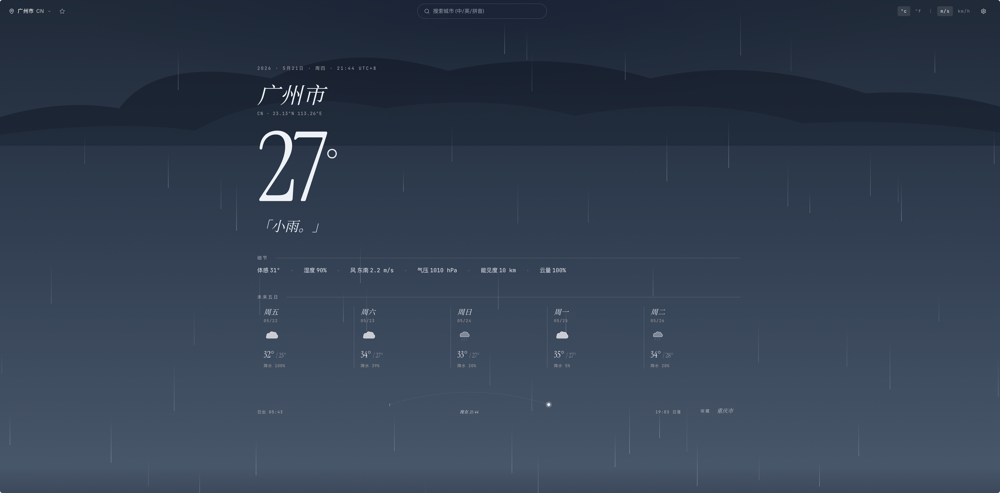

# Your Weather

> 天气,可读如诗。一个编辑式版面的天气查询应用。


## 截图

上海 · 多云


广州 · 小雨



重庆 · 晴夜


## 特性

- 🔍 城市查询(中文 / 英文 / 拼音)
- 📍 浏览器地理定位 + 反向地理编码
- 🌡 当前天气:温度 · 体感 · 湿度 · 风速风向 · 气压 · 能见度 · 云量
- 📅 未来 5 天预报(从 3 小时步长聚合)
- ⭐ 城市收藏(LocalStorage 持久化)
- 🎨 7 种天气主题动态背景:晴日 / 晴夜 / 多云 / 雨 / 雪 / 雷暴 / 雾
- 🌧 纯 CSS 雨/雪/星辰/雾/闪电动画
- 🔧 单位切换 °C/°F、m/s/km/h
- 🔑 UI 可粘贴 API key 覆盖默认

## 设计

设计稿见 [docs/ui-mockup.html](docs/ui-mockup.html)(在浏览器打开)。

风格定位:**Editorial Atmospherics** — 编辑式版面 + 沉浸式氛围。
拒绝浮空玻璃卡片,拒绝模板化渐变,以衬线巨型温度数字为视觉锚点,
背景层用 SVG + CSS 动画呈现真实大气感。

字体:
- Display — **Instrument Serif** + 中文回退 **Noto Serif SC**
- UI — **Geist** + 中文回退 **Noto Sans SC**
- 数值 — **JetBrains Mono**(`tabular-nums` 等宽对齐)

## 运行

```bash
npm install
npm run dev          # 启动 dev server,默认 http://localhost:5173
npm run build        # 生产构建到 dist/
npm run preview      # 预览生产构建
npm run typecheck    # tsc 类型检查
```

## API key

OpenWeatherMap 免费版,60 次/分钟、1M 次/月。

默认 key 已写入 `.env`(已入库,个人项目接受暴露风险)。
如果该 key 失效或被限流,可在应用右上角 ⚙ **设置** 中粘贴自己的 key,
覆盖会持久化到 LocalStorage(`your-weather:apikey-override`)。

[去 openweathermap.org 注册自己的 key](https://openweathermap.org/api)。

## 项目结构

```
src/
├── api/
│   ├── client.ts        # fetch 封装 + 内存缓存 (10 min TTL) + 错误归一化
│   ├── openweather.ts   # 4 个端点 + 日预报聚合
│   └── types.ts         # 所有领域类型
├── components/
│   ├── WeatherBackground.tsx   # 7 种主题场景 + 装饰(SVG+CSS)
│   ├── CurrentWeather.tsx      # hero:温度、描述、stat strip
│   ├── ForecastList.tsx        # 5 天预报横向 5 列
│   ├── SunArc.tsx              # 日轨弧线 + 当前位置标记
│   ├── FavoritesList.tsx       # 底部 chip rail
│   ├── TopBar.tsx              # 城市/搜索/单位/设置
│   ├── SearchBar.tsx           # 防抖搜索 + 下拉建议
│   ├── SettingsPanel.tsx       # 抽屉:单位 + API key + 清缓存
│   ├── WeatherIcon.tsx         # 7 种天气小型 inline SVG glyph
│   ├── ApiKeyPrompt.tsx        # key 失效/缺失横幅
│   ├── LoadingSkeleton.tsx
│   └── EmptyState.tsx
├── hooks/
│   ├── useDebounce.ts
│   ├── useGeolocation.ts
│   ├── useWeather.ts           # 并发拉取当前 + 预报
│   └── useCitySearch.ts
├── store/
│   ├── favorites.ts            # zustand + persist
│   ├── units.ts                # zustand + persist
│   ├── currentCity.ts
│   └── apiKey.ts               # 用户 override
├── utils/
│   ├── format.ts               # 温度/风速/时间/坐标格式化
│   └── weatherTheme.ts         # weatherId → Theme
├── App.tsx
├── main.tsx
└── index.css                   # Tailwind + scene CSS + 动画 keyframes
```

## 文档

- [需求文档](docs/requirements.md)
- [开发文档](docs/development.md)(API、数据模型、流程)
- [执行计划](docs/plan.md)
- [UI 设计稿](docs/ui-mockup.html)

## 已知取舍

- **API key 在前端**:免费版个人项目,可接受。生产建议走自有代理。
- **没有 One Call API 3.0**:免费版不开放,5 天预报用 `/forecast`(3 小时步长)聚合,精度略低。
- **不写单测**:个人项目,靠浏览器手工 verify。
- **不做 PWA / 离线**:超出本期范围。

## License

MIT — 见 [LICENSE](LICENSE)。
